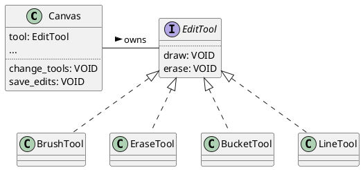
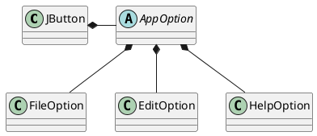
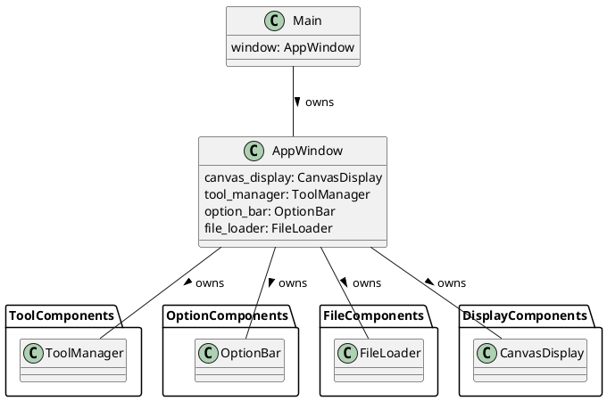

```plantuml
@startuml
class Canvas{
tool: EditTool
...
..
change_tools: VOID
save_edits: VOID
}

interface EditTool {
..
draw: VOID
erase: VOID
}
EditTool <|.. BrushTool
EditTool <|.. EraseTool
EditTool <|.. BucketTool
EditTool <|.. LineTool

Canvas – EditTool: > owns
@enduml

```
```
```


```plantuml
@startuml
class JButton
Abstract AppOption

JButton *-Right- AppOption 
class FileOption
class EditOption
class HelpOption

AppOption *-Down- FileOption
AppOption *-Down- EditOption 
AppOption *-Down- HelpOption


@enduml
```
```

```



```plantuml
@startuml
class Main{
window: AppWindow 
}
class AppWindow{ 
canvas_display: CanvasDisplay 
tool_manager: ToolManager 
option_bar: OptionBar 
file_loader: FileLoader

}

package ToolComponents <<Folder>> {
  class ToolManager
}

package OptionComponents <<Folder>> {
  class OptionBar
}

package FileComponents <<Folder>> {
  class FileLoader 
}

package DisplayComponents <<Folder>> {
  class CanvasDisplay 
}

Main -down- AppWindow :> owns
AppWindow -down- ToolManager :> owns
AppWindow -down- CanvasDisplay :> owns
AppWindow -down- FileLoader :> owns
AppWindow -down- OptionBar  :> owns


@enduml
```


![[Pasted image 20221119171951.png]]


